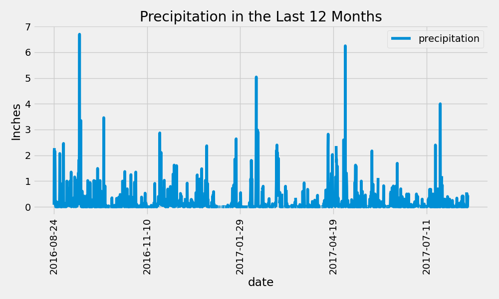
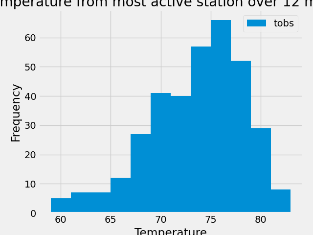

# Holiday Vacation in Honolulu! -Surfs Up (sqlalchemy_challenge)

# Background
Congratulations! You've decided to treat yourself to a long holiday vacation in Honolulu, Hawaii. 
To help with your trip planning, you decide to do a climate analysis about the area. The following 
sections outline the steps that you need to take to accomplish this task.

---
## Part 1: Analyze and Explore the Climate Data
Use Python and SQLAlchemy to do a basic climate analysis and data exploration of your climate database. 
Specifically, use SQLAlchemy ORM queries, Pandas, and Matplotlib. To do so, complete the following steps:

-  Use the SQLAlchemy create_engine() function to connect to your SQLite database.
-  Use the SQLAlchemy automap_base() function to reflect your tables into classes, and then 
    save references to the classes named station and measurement.
-  Link Python to the database by creating a SQLAlchemy session.
-  Perform a precipitation analysis and then a station analysis

###  Precipitation Analysis
-  Find the most recent date in the dataset.
-  Using that date, get the previous 12 months of precipitation data by querying the previous 12 months of data.
-  Select only the "date" and "prcp" values.
-  Load the query results into a Pandas DataFrame. Explicitly set the column names.
-  Sort the DataFrame values by "date".
-  Plot the results by using the DataFrame plot method.
-  Use Pandas to print the summary statistics for the precipitation data.

###  Station Analysis
-  Design a query to calculate the total number of stations in the dataset.
-  Design a query to find the most-active stations (that is, the stations that have the most rows). To do so, 
    complete the following steps:
    *  List the stations and observation counts in descending order.
    *  Answer the following question: which station id has the greatest number of observations?
-  Design a query that calculates the lowest, highest, and average temperatures that filters on the most-active 
    station id found in the previous query.
-  Design a query to get the previous 12 months of temperature observation (TOBS) data. To do so, complete the following steps:
    *  Filter by the station that has the greatest number of observations.
    *  Query the previous 12 months of TOBS data for that station.
    *  Plot the results as a histogram with bins=12
-  Close your session.

 

 ---
 
## Part 2: Design Your Climate App
-  Now that you’ve completed your initial analysis, you’ll design a Flask API based on the 
    queries that you just developed. 
### Routes
-  `/`
    *  Start at the homepage
    *  List all the available routes
    
-  `/api/v1.0/precipitation`
    *  Convert the query results to a Dictionary using `date` as the key and `prcp` as the value
    *  Return the JSON representation of your dictionary.

-  `/api/v1.0/stations`
    *  Return a JSON list of stations from the dataset.

-  `/api/v1.0/tobs`
    *  Query the dates and temperature observations of the most-active station for the previous year of data.
    *  Return a JSON list of temperature observations for the previous year.
    
-   `/api/v1.0/<start>` and `/api/v1.0/<start>/<end>`
    *  Return a JSON list of the minimum temperature, the average temperature, and the maximum temperature 
        for a specified start or start-end range.
    *  For a specified start, calculate TMIN, TAVG, and TMAX for all the dates greater than or equal to the start date.
    *  For a specified start date and end date, calculate TMIN, TAVG, and TMAX for the dates
         from the start date to the end date, inclusive.
